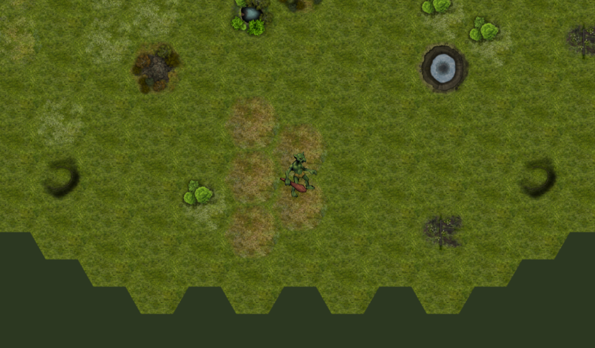

# Hexagonal Game

My experimental changes with a demo Godot project, changing it from a basic demo of a hex grid to a base for a larger game. Gotta work on those fundamentals!

Language: GDScript

Renderer: GLES 2

Check out the original demo on the asset library: https://godotengine.org/asset-library/asset/111

## Screenshots

